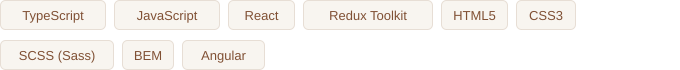
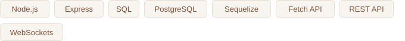

I’m a full-stack developer based in Kyiv, Ukraine. I build responsive interfaces with React and TypeScript and work with Node.js, REST APIs and PostgreSQL.

## Tech stack

<table>
<tr><td><b>Frontend</b></td><td></td></tr>
<tr><td><b>Backend</b></td><td></td></tr>
<tr><td><b>Tools</b></td><td></td></tr>
<tr><td><b>Concepts</b></td><td></td></tr>
<tr><td><b>Languages</b></td><td></td></tr>
</table>

## Featured projects

<table>
<tr>
<td width="50%" valign="top">

<h3>Nice Gadgets Store</h3>

A responsive e-commerce app with product filtering, detail pages, a shopping cart and global state management.

<code>React</code> <code>TypeScript</code> <code>Redux Toolkit</code> <code>SCSS</code>

<a href="https://react-ecommerce-store-z24j.vercel.app">Live demo ↗</a> · <a href="https://github.com/Vladislav-Korsun/react-ecommerce-store">Source code ↗</a>

</td>
<td width="50%" valign="top">

<h3>Nothing Store Landing</h3>

A responsive product landing page with a mobile menu, product sections and carefully structured BEM styles.

<code>HTML</code> <code>SCSS</code> <code>JavaScript</code> <code>BEM</code>

<a href="https://Vladislav-Korsun.github.io/nothing-store-landing/">Live demo ↗</a> · <a href="https://github.com/Vladislav-Korsun/nothing-store-landing">Source code ↗</a>

</td>
</tr>
</table>

## More projects

| Project | Focus | Stack | Links |
| :--- | :--- | :--- | :--- |
| **Angular Todo** | API integration, reactive forms, priorities and filtering | Angular · TypeScript · RxJS | [Demo ↗](https://vladislav-korsun.github.io/angular-todo/) · [Code ↗](https://github.com/Vladislav-Korsun/angular-todo) |
| **2048 Game** | Game logic, tile merging, keyboard controls and score tracking | JavaScript · SCSS · OOP | [Demo ↗](https://Vladislav-Korsun.github.io/js-2048-game/) · [Code ↗](https://github.com/Vladislav-Korsun/js-2048-game) |

---

[Explore my repositories ↗](https://github.com/Vladislav-Korsun?tab=repositories)

